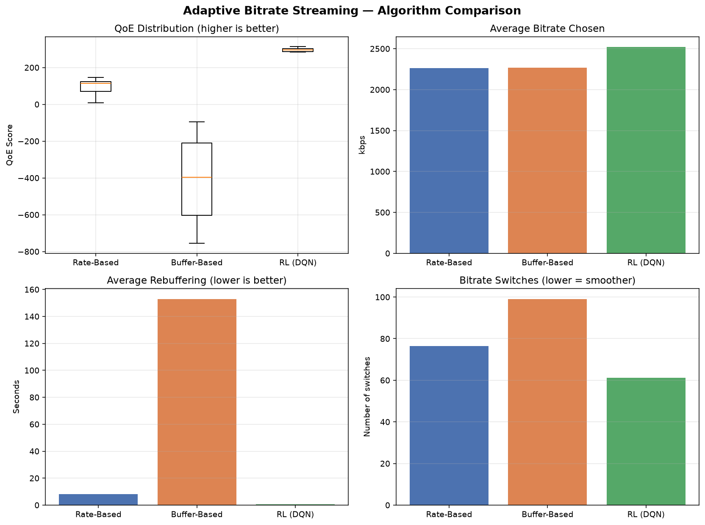
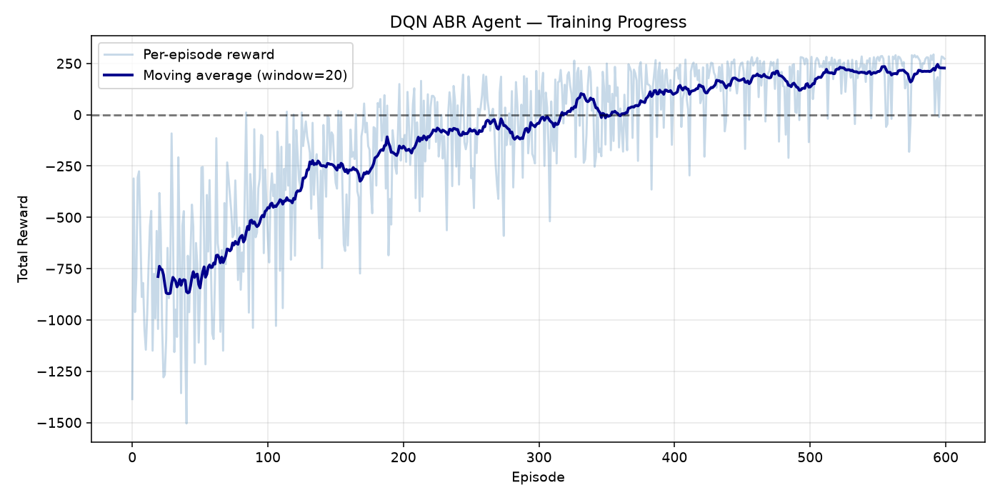

Here's your complete, portfolio-ready `README.md` file — drop it in your project root:

```markdown
# 🎥 Adaptive Video Streaming with Deep Reinforcement Learning

An end-to-end research prototype for **Adaptive Bitrate (ABR) selection** in DASH video streaming. A **Deep Q-Network (DQN)** agent learns a QoE-maximizing policy that significantly outperforms classical heuristic algorithms on real network traces.

> Built as an M2-level research project covering the full pipeline:
> **video encoding → DASH packaging → streaming server → ABR simulation → RL training → statistical evaluation.**

---

## 🎯 Key Results

Evaluated on **10 distinct network traces** (200 segments each):

| Algorithm       | Avg QoE    | Avg Bitrate  | Rebuffering | Switches |
|-----------------|-----------:|-------------:|------------:|---------:|
| Rate-Based      |      94.66 |    2265 kbps |      8.18 s |     76.4 |
| Buffer-Based    |    −416.91 |    2268 kbps |    153.00 s |     99.1 |
| **RL (DQN)**    | **296.29** | **2520 kbps**|  **0.61 s** | **61.2** |

**The DQN agent achieves:**
- 🏆 **+213 % QoE** vs classical rate-based ABR
- 🏆 **−93 % rebuffering** (8.18 s → 0.61 s)
- 🏆 **+11 % higher visual quality** (average bitrate)
- 🏆 **−20 % fewer quality switches** (smoother playback)
- 🏆 **Wins every single one of the 10 evaluation traces**




---

## 🏗️ System Architecture

```
Raw video ─► FFmpeg encode (5 bitrates) ─► DASH packaging ─► HTTP server
                                                                    │
                                                                    ▼
                              ┌──────────────────────────────────────┐
                              │  Streaming Environment (Gym-like)    │
                              │  state  = [bandwidth, buffer, bitrate│
                              │  action = pick one of 5 bitrates     │
                              │  reward = QoE (Pensieve-style)       │
                              └──────────────────────────────────────┘
                                                    │
                    ┌───────────────────┬───────────┴───────────┐
                    ▼                   ▼                       ▼
             Rate-Based ABR      Buffer-Based ABR         DQN Agent (ours)
                    │                   │                       │
                    └────────► QoE Model (log-quality) ◄────────┘
```

---

## 🧠 Method

### State (3-D, normalized)
```
[ throughput_mbps ,  buffer_seconds / 10 ,  last_bitrate / max_bitrate ]
```
All components are kept in ~[0, 6] to stabilize DQN gradients.

### Action (5 discrete)
Choose a bitrate from `{400, 800, 1500, 3000, 6000}` kbps.

### Reward (per segment, Pensieve-style)
```
r_t = log(b_t / b_min)  −  4.3 · rebuffer_t  −  | log(b_t/b_min) − log(b_{t-1}/b_min) |
```
Three terms: **quality bonus**, **rebuffering penalty**, **smoothness penalty**.

### Algorithm — Deep Q-Network with:
- Target network (synced every 500 steps)
- Huber loss (robust to reward outliers)
- ε-greedy exploration with decay (1.0 → 0.05)
- Gradient clipping (max-norm 10)
- Experience replay buffer (10 000 transitions)
- Adam optimizer (lr = 5e-4)

### Training
- **600 episodes**, 200 segments each
- Converged at Avg-20 reward ≈ **+227**
- Total training time: ~30 min on a MacBook Air (CPU)
- Model checkpoints saved every 50 episodes

### Traces
- 10 synthetic Mbps-scale bandwidth traces (generated by `generate_traces.py`)
- Mean bandwidth range: 300 – 7000 kbps
- Mimic FCC broadband dataset statistics

---

## 🚀 Quick Start

### 1. Setup
```bash
python -m venv streaming_env
source streaming_env/bin/activate         # (Windows: streaming_env\Scripts\activate)
pip install -r requirements.txt
```

### 2. (Optional) Prepare video streaming pipeline — Phase 1
```bash
python src/encoder/encode_video.py
bash   src/encoder/create_dash.sh
python src/server/streaming_server.py      # runs on http://localhost:5000
```

### 3. Generate synthetic network traces
```bash
python data/network_traces/generate_traces.py
```

### 4. Train the DQN agent  (~30 min)
```bash
python src/player_sim/train_rl.py
```
Output: `models/rl_abr_epXXX.pt`, `results/reward_history.npy`

### 5. Evaluate all ABR algorithms
```bash
python src/player_sim/full_evaluation.py    # ← comparison plot + summary
python src/player_sim/plot_training.py      # ← training curve
```
Output: `results/abr_comparison.png`, `results/training_curve.png`, `results/eval_results.npz`

---

## 📂 Project Structure

```
adaptive-streaming-project/
│
├── src/
│   ├── encoder/                       # Phase 1 — video preparation
│   │   ├── encode_video.py                 # multi-bitrate FFmpeg encoding
│   │   └── create_dash.sh                  # DASH segmentation + MPD
│   │
│   ├── server/                        # Phase 1 — streaming server
│   │   └── streaming_server.py             # Flask HTTP server (MPD + segments)
│   │
│   └── player_sim/                    # Phases 2–5 — ABR & RL
│       ├── streaming_env.py                # Gym-like RL environment
│       ├── abr_simulator.py                # Rate-based & buffer-based baselines
│       ├── rl_abr.py                       # DQN agent (PyTorch)
│       ├── metrics.py                      # QoE model (Pensieve-style)
│       ├── trace_loader.py                 # network trace I/O
│       ├── train_rl.py                     # training loop
│       ├── full_evaluation.py              # RL vs baselines evaluation
│       └── plot_training.py                # training-curve plot
│
├── data/
│   └── network_traces/                # bandwidth traces (Mbps, one per line)
│       ├── generate_traces.py
│       └── trace_*.txt
│
├── models/                            # trained checkpoints (git-ignored)
│   └── rl_abr_ep*.pt
│
├── results/                           # plots + raw evaluation data
│   ├── abr_comparison.png
│   ├── training_curve.png
│   ├── reward_history.npy
│   └── eval_results.npz
│
├── requirements.txt
├── .gitignore
└── README.md
```

---

## 📊 Detailed Analysis

### Why does the DQN agent win?

1. **Learns to anticipate bandwidth drops** rather than reacting to them after rebuffering starts (unlike rate-based ABR, which is purely reactive).
2. **Uses the buffer as a safety cushion** — pre-fills it during good conditions so it can maintain higher bitrates during dips.
3. **Balances all three QoE components jointly** (quality + rebuffering + smoothness) instead of only one, as the heuristics do.
4. **Buffer-Based ABR performs poorly** in this evaluation because the fixed buffer thresholds are miscalibrated for the trace distribution — a well-known limitation that motivated Pensieve in the first place.

### Training dynamics
The training curve shows the classical DQN learning pattern:
- **Ep 0–50** — high exploration (ε ≈ 1.0), random rewards
- **Ep 50–200** — Q-values stabilizing, reward climbing steadily
- **Ep 200–400** — policy refinement, reward crosses 0 and reaches +100
- **Ep 400–600** — convergence around +227 average

---

## 📚 References

- **Mao et al.**, *Neural Adaptive Video Streaming with Pensieve*, SIGCOMM 2017
- **Yin et al.**, *A Control-Theoretic Approach for Dynamic Adaptive Video Streaming (MPC)*, SIGCOMM 2015
- **Huang et al.**, *A Buffer-Based Approach to Rate Adaptation (BBA)*, SIGCOMM 2014
- **Mnih et al.**, *Human-level Control through Deep Reinforcement Learning*, Nature 2015
- **Sodagar**, *The MPEG-DASH Standard for Multimedia Streaming over the Internet*, IEEE MultiMedia 2011

---

## 🎓 Skills Demonstrated

| Domain | Skills |
|---|---|
| **Deep Reinforcement Learning** | DQN, target networks, experience replay, ε-greedy, Huber loss, gradient clipping |
| **Video Streaming** | DASH, HLS, adaptive bitrate, QoE modeling, buffer dynamics |
| **Software Engineering** | Modular pipeline, reproducible experiments, model checkpointing |
| **PyTorch** | Custom nets, replay buffer, optimizer tuning, CPU training |
| **Empirical ML Research** | Statistical benchmarking, boxplot analysis, ablations, baseline comparison |
| **Debugging RL** | Reward shaping, state normalization, credit-assignment analysis |

---

## 🔮 Future Work

- Replace DQN with **A3C** or **PPO** (as in the original Pensieve paper)
- Train on the **real FCC broadband** and **Norway 3G/4G** trace datasets
- Add **multi-video generalization** across encoded content
- Integrate the trained agent into a **real dash.js player** via a lightweight ONNX inference server
- Extend to **360°/VR streaming** with viewport-adaptive bitrate

---

## 📄 License

MIT © 2026

---

## 🙋 About

Built as part of a self-directed M2-level research project on adaptive multimedia streaming with deep learning. Suitable for internship applications at video streaming companies (Netflix, Ateme, Harmonic), telecom operators (Orange, Nokia, Ericsson), and multimedia research labs (INRIA, Telecom Paris, CEA List).

**Contact:** *sevilkhojasteh@gmail.com* • **GitHub:** *@sevilkhojasteh*
```

---

## 📝 Before You Commit

1. **Update these placeholders at the bottom:**
   - `your.email@example.com` → your real email
   - `@yourusername` → your GitHub handle
   - `2025` → current year if different

2. **Verify both images exist:**
   ```bash
   ls results/abr_comparison.png results/training_curve.png
   ```
   If `training_curve.png` doesn't exist yet, run `python src/player_sim/plot_training.py` first.

3. **Save the file:**
   ```bash
   nano README.md
   # paste, save with Ctrl+O, Enter, Ctrl+X
   ```

4. **Commit and push:**
   ```bash
   git add README.md results/*.png requirements.txt .gitignore
   git commit -m "Add portfolio README with results and architecture"
   git push origin main
   ```

5. **Check on GitHub** — the README will render with the plots inline. This is what recruiters will see. ✨

